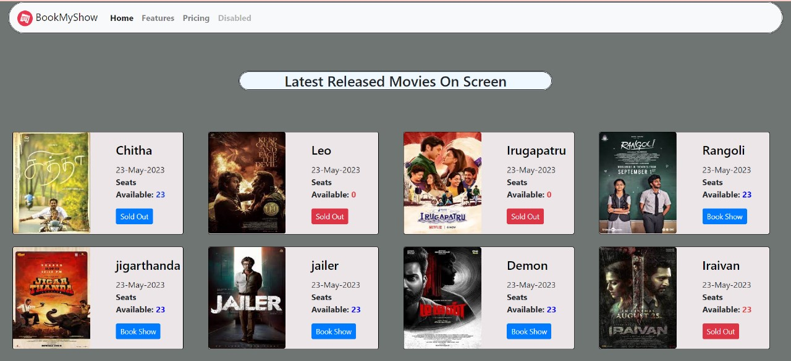

<h1>Movie Ticket Booking Desing</h1>

To achieve the events layout. I used bootstrap rows&cols to create new row and used cols to split the columns. no of divs with style properties heigth, width, border-radius..etc

<h3>Learned</h3>
<ul>
  <il>Nav-bar</il>
   <il>margining between two container</il>
   <il>button property</il>
  <il>bootstrap classes</il>
</ul>
<h2>And my output will be</h2>

